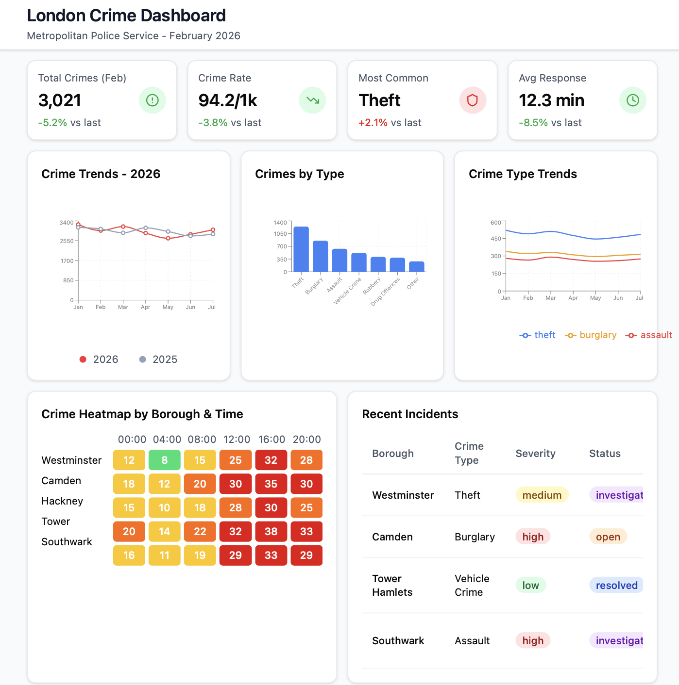

## Section 1: Motivation and Purpose

## Section 2: Description of the Data

## Section 3: Research Questions & Usage Scenarios

Persona:

-   Jessica works at the London bureau investigation and wants a quick understanding of crimes over the past couple of years in the UK. With the use of this dashboard, Jessica can get an understanding o f key numbers in one glance and use the charts to get a better visualization of the number of crimes and trends over time.

Usage Need Scenario:

-   Eployees working government jobs, specifically those concerned with London's safety could use this dashboard for a quick understanding of crimes rate over the past several years.

-   People moving to London can use this dashboard as a quick understanding of which borough has the highest or lowest crime rate, helping them decide which borough to consider for living.

-   Tourist are usually unfamiliar with London, so with the use of this dashboard, tourists can understand which neighborhood is safe to get a hotel or walk around at night.

User Stories:

-   My family and I are from the United States and we want to visit London for a summer trip. We have two kids under the age of five and we want to make sure our hotel is in a safe and quiet neighborhood. We want to make sure the location of our hotel has the lowest crime rate across all boroughs of London.

-   I have recently moved from Barcelona, Spain to London. I work at home and want to ensure the borough I move into has the lowest crime rate. This would ensure that I could safely stay home, and not worry about any solicitors and intruders, especially at night.

-   I work at a law firm, and our client was robbed of his possessions in Barnet, a borough in London. The defense argues that no crimes have occurred in that borough for the past two years. Using this dashboard, we can quickly validate or disprove this claim.

## Section 4: Exploratory Data Analysis

#### [Heat Map Visualization:]{.underline}

-   With the use of the heat map, users can easily hover over their desired borough and check the number or crime rates. This heat map is especially useful for users that are looking for a specific neighborhood/borough and the number of crimes, and the type of crime that took place there. The heat map could be a useful visualization for the lawyer, checking the for the median number of crimes in Barnet.

#### [Line Plot Visualization:]{.underline}

-   For users wanting to see the safest neighborhoods in London, they could use this line plot to get an understanding of the top 10 safest boroughs in London. With this line plot, the number of crimes over the past several years is shown, giving the user a quick and easy visualization of the potential borough they want to live in.

## Section 5: App Sketch & Description

